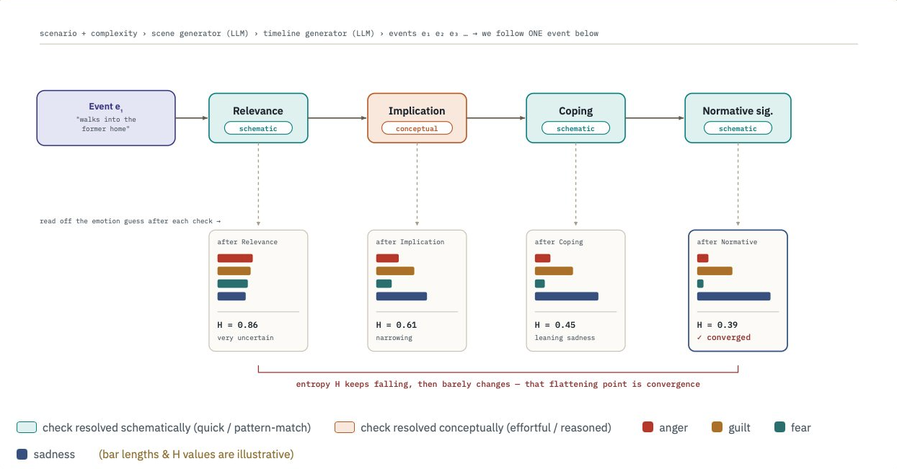
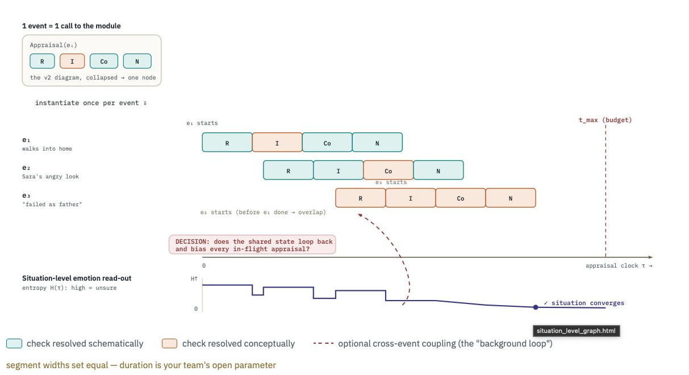

# CPM Appraisal Convergence Pipeline

DSAIT4230 — Research in Social Signal Processing & Affective Computing, TU Delft.

## About the project

We feed an LLM (playing a fixed persona, **Alex**) a social situation. Instead of
asking "what emotion is this?" in one shot, the model appraises the situation
step by step through Scherer's four **Stimulus Evaluation Checks** (Relevance →
Implication → Coping → Normative). At each step the appraisal ratings are turned
into a **probability distribution over 13 discrete emotions**, and we track the
**entropy** of that distribution. The core question: does the emotion *lock in*
(entropy stabilises) before all information is processed, and do **more complex
situations take more steps to lock in**?

## Timelines

- **Event timeline** (`e1, e2, …`): the situation is revealed gradually as a
  sequence of discrete events.
- **Appraisal timeline** (`τ = 1, 2, …`): within processing, each check costs
  time — *schematic* checks cost 1 step, *conceptual* checks cost 3 — against a
  budget `t_max`. Convergence is the point on this timeline where entropy stops
  changing.

## Assumptions

We assume that appraisal processing may overlap across events. A new event can begin being appraised before the previous event’s appraisal has fully finished. All appraisal activity is handled on one shared appraisal clock with overlapping processing windows.

Therefore, the implementation uses only two relevant temporal structures:

1. the event timeline, which determines when events become available to Alex;
2. the appraisal clock τ, which determines how perceived events are processed internally.

This keeps the model aligned with the conceptual framing while remaining simple enough to implement within the project timeline.

## Reference diagrams

**1 — Appraisal module (one event).** One event → four checks in
order → each check resolved schematically *or* conceptually → after each check, read off the emotion distribution and
its entropy H → H falls and flattens → convergence.



**2 — The whole situation (events on one shared clock).** Each event's module
collapses to a single bar. Events are staggered on the shared τ clock and their
processing windows overlap. The situation-level emotion is read from all checks
completed so far; H(τ) is tracked until it settles or `t_max` is hit.



> **Open modeling decision** (the dashed "background loop" in diagram 2):
> should the shared state loop back and re-bias events still being processed?
> This is **OFF by default** (`SchedulerConfig.cross_event_coupling = False`).
> Turning it on means cyclical re-appraisal — extra complexity and a convergence
> guarantee we can't validate in two weeks. It's already listed as a *limitation*
> in the report, so excluding it keeps the project self-consistent. Leave it for
> future work.

## Architecture

```
seed + complexity ─▶ generation/ ─▶ scenario (narrative + events)
                                          │
                                          ▼
              appraisal/scheduler.py  (two-timeline loop, budget t_max)
                     │  per (event, SEC):
                     │    levels.py  → schematic (1 step) or conceptual (3)
                     │    secs.py    → run that check on the LLM
                     ▼
              trajectory of AppraisalStep
                     │
                     ▼
              emotions/  → distance to 13 prototypes → distribution → entropy
                     │
                     ▼
              convergence/ → first stable τ, entropy trace
```

Every stage is its own module under `src/cpm_appraisal/`, talks only through the
dataclasses in `types.py`, and is independently testable.

## Running codebase

```bash
pip install -e .
pytest -q                          # tests
python scripts/run_experiment.py   # full pipeline on the MockLLM
```

The current setup uses a **deterministic mock LLM**, so the whole pipeline runs
end-to-end. We plan to develop and review logic against the mock, then swap in a
real model with `--backend`.

## Swapping in a real model

`src/cpm_appraisal/llm/__init__.py` defines backends behind one interface:

| backend | use |
|---|---|
| `mock` | development, CI, reviewing logic (default) |
| `local_transformers` | in-process HuggingFace model |

## Team
Rheea, Florin, Irene, Yolina, Levi.
